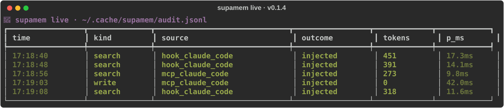

**Языки:** [English](README.md) · [简体中文](README.zh-CN.md) · [Español](README.es.md) · [日本語](README.ja.md) · [Русский](README.ru.md)

<!-- synced-with: README.md @ b5a3522 -->

> Перевод выполнен с помощью ИИ. Корректировки от носителей языка приветствуются — открывайте PR.

<div align="center">

# 🧠 supamem

**Двойная память на базе Qdrant для AI-агентов программирования**

*Дайте Claude Code, Cursor и OpenCode постоянную семантическую + структурную память во всех проектах.*

[](https://pypi.org/project/supamem/)
[](https://www.python.org/)
[](LICENSE)
[](https://qdrant.tech/)
[](https://modelcontextprotocol.io/)
[](https://app.softchat.ru)

</div>

---

> ### 👋 Создано [**Дмитрием Суховым**](https://www.linkedin.com/in/dzmitrys/) — AI-native Solution / Software Architect / CTO
>
> Доступен для **консалтинга** по AI-продуктам, **интеграции AI в существующие продукты** и **автоматизации бизнес-процессов**.
>
> Если вы запускаете LLM-фичи, оцениваете retrieval-пайплайны, укрепляете агентные системы или строите AI-first продукт с нуля — давайте поговорим.
>
> [](https://www.linkedin.com/in/dzmitrys/)
> &nbsp;&nbsp;
> [](https://www.linkedin.com/in/dzmitrys/)

---

## ✨ Что такое supamem?

`supamem` — это однобинарный CLI, который подключает **слой памяти продакшен-уровня** к любому
AI-ассистенту программирования. Закиньте его в свежий репозиторий, выполните `supamem init` —
и ваши агенты мгновенно получат:

- 🔍 **Семантический поиск** по проектным заметкам, ADR, решениям и прошлым диалогам (гибридный sparse+dense retrieval)
- 🤖 **MCP-сервер**, к которому может подключиться любой совместимый клиент (Claude Code, Cursor, OpenCode)
- 🪝 **Хуки на каждого клиента**, автоматически подгружающие релевантную память при старте сессии и редактировании файлов
- 📊 **Статистику Welford**, чтобы видеть, какая память реально вызывается
- 🧪 **Eval-харнесс** с золотым корпусом из 33 запросов для обнаружения регрессий retrieval

Обкатано в продакшене внутри [SoftChat](https://app.softchat.ru) (фазы 80.1–80.5) перед тем,
как было выделено в самостоятельный пакет, который может принять любая команда.

---

## 🎯 Зачем нужен supamem

**Проблема:** У агентов программирования нет памяти между сессиями. Каждый раз, открывая новый
диалог в Claude Code / Cursor / OpenCode, модель не знает ничего о вашем коде, прошлых решениях,
ADR, известных проблемах или соглашениях. Поэтому либо:

1. Вы **переклеиваете 5–15 КБ контекста** в начале каждой сессии (медленно, чревато ошибками, дорого), либо
2. Вы даёте агенту **барахтаться** — он бегает grep'ом по репозиторию, задаёт повторные вопросы,
   забывает решения недельной давности и заново открывает те же грабли, которые вы документировали
   полгода назад.

**Решение:** Постоянный семантический + структурный слой памяти, который автоматически достаёт
*правильные* 1–2 КБ контекста для *текущего* промпта — без ручной вставки, без повторных объяснений,
без раздувания контекста.

> **Бенч фазы 80.1 (33 размеченных golden, реальные сессии Claude Code):**
> **−78.5% токенов vs наивный whole-doc retrieval** при том же recall, **p95 73 мс** end-to-end.
>
> Полная оценка — та же, что мы прогнали внутри SoftChat для фиксации продакшен-пайплайна.
> Методология: 33 репрезентативных dev-запроса → сравнение 4 retrieval-плеч (baseline_union,
> tuned_current, tuned_hybrid, mem0_vector) → измерены token count + recall CI + латентность по плечам.

### 📊 Расход токенов: агент с памятью vs без

Цифры ниже — на **типичную 30-ходовую сессию Claude Code** при реальной кодовой базе с ~50 ADR /
insights / rules (≈ как у SoftChat). YMMV — но *соотношение* между плечами держится.

| Подход | Токенов/ход | Токенов/30-ходовую сессию | Заметки |
|---|---:|---:|---|
| ❌ Без слоя памяти | Авто-инъекция **≈ 0**, но контекст вы клеите вручную | **30 000–80 000** (ручная вставка, повторно) | Когнитивная нагрузка уходит на копирование, а не на сборку |
| ⚠️ Наивный RAG (whole-doc embed) | ~5 800 / ход | **~174 000** | Раздуто, тянет большие файлы, когда нужен был один абзац |
| ✅ **supamem `tuned_hybrid`** | **~1 250 / ход** | **~37 500** | Тот же recall, **−78.5% токенов** vs наивный RAG |

### 💰 Примерная экономия на стоимости инференса

Прайс Anthropic API (март 2026):
**Sonnet 4.6 = $3 / Mtok input** · **Opus 4.7 = $15 / Mtok input**.

| Модель | Сэкономлено токенов/сессию vs наивный RAG | Сэкономлено $/сессию | В месяц (110 сессий) |
|---|---:|---:|---:|
| Sonnet 4.6 | **136 500** | **$0.41** | **~$45/разработчик** |
| Opus 4.7 | **136 500** | **$2.05** | **~$225/разработчик** |

Команда из 10 инженеров на Opus экономит **~$2 250/месяц** только на input-токенах — без учёта
стоимости медленных итераций, потерянных решений и времени на повторное вставление контекста.
Экономия output-токенов (меньше галлюцинаций, меньше туда-сюда) ложится сверху.

### 🥊 Сравнение с альтернативами

| | Без памяти | Наивный RAG | mem0 / атомарные факты | **supamem (tuned_hybrid)** |
|---|:---:|:---:|:---:|:---:|
| Авто-инъекция при старте сессии | ❌ | ⚠️ | ✅ | ✅ |
| Гибридный sparse+dense retrieval | ❌ | ❌ | ❌ | ✅ |
| Сохранение код-идентификаторов | ❌ | ✅ | ❌ (теряет имена) | ✅ |
| Зафиксированная схема + golden eval | ❌ | ❌ | ❌ | ✅ |
| Multi-client (Claude/Cursor/OpenCode) | ❌ | ❌ | ⚠️ | ✅ |
| Латентность p95 | n/a | ~120 мс | ~80 мс | **73 мс** |
| Раздувание токенов | Высокое (вручную) | Самое высокое | Низкое, но с потерями | **Самое низкое при полном recall** |

**Почему гибрид?** BM25 ловит *точные идентификаторы* (`ChatService.generate`, имена env-переменных,
пути файлов), которые dense embeddings размазывают. Dense ловит *семантическое намерение*
("как мы обрабатываем billing-вебхуки?"), которое BM25 пропускает. RRF-фьюжн объединяет оба
ранжирования, чтобы получить лучшее от каждого.

**Почему не mem0?** Извлечение атомарных фактов в mem0 теряет код-идентификаторы — recall на бенче
из 33 запросов был **0.015** (фактически ноль). Отлично для персональной памяти типа CRM, не для
кодо-aware retrieval.

---

## ⚡️ Быстрый старт за 60 секунд

```bash
# 1. Установка (uv — самый быстрый путь)
uv tool install supamem

# 2. Запустить Qdrant (один раз, ~30с)
docker run -d -p 6333:6333 -p 6334:6334 -v $HOME/.qdrant:/qdrant/storage qdrant/qdrant:latest

# 3. Проинициализировать ваш проект
cd your-project
supamem init

# 4. Подключить к AI-клиенту
supamem install --client claude-code   # или cursor / opencode

# 5. Проверить, что всё здорово
supamem doctor
```

И всё. Откройте Claude Code (или ваш предпочитаемый клиент) внутри проекта — инструмент памяти уже в меню. ✨

---

## 👀 Посмотрите как работает — `supamem live`

Запустите `supamem live` в соседнем терминале, чтобы видеть каждый retrieval-вызов в реальном времени — отлично подходит рядом с Claude Code / Cursor / OpenCode для мгновенной видимости тихих PreToolUse-инъекций (которые и экономят токены за счёт того, что НЕ показывают UI).



**SessionStart-баннер** (v0.1.4+) также вставляет однострочный статус в ваш AI-клиент при открытии сессии: `🧠 supamem v0.1.4 · <collection> · <N> chunks · audit <path>` — авто-детект Claude Code / Cursor / OpenCode по env-переменным.

> 🎬 **Интерактивное демо:** [`supamem-live.cast`](docs/media/supamem-live.cast) — закиньте в [asciinema.org/player](https://asciinema.org/) или запустите локально `asciinema play docs/media/supamem-live.cast`.

---

## 🚀 Возможности

| Возможность | Описание |
|---|---|
| 🔍 **Гибридный retrieval** | Настроенная фьюжн sparse (BM25) + dense (MiniLM), зафиксированная схема D-25 |
| 🎯 **Code-aware reranker** | Cross-encoder `mxbai-rerank-base-v2` (Apache-2.0) по умолчанию переоценивает кандидатов `tuned_hybrid`. Отключается `retrieval.reranker = "off"` — возврат к поведению до v0.2.4a1. (Phase 8, RERANK-01..04) |
| ⏳ **Per-source временная валидность** | Каждый чанк несёт `valid_from`/`valid_to`; переиндексация изменённого файла атомарно помечает прежние чанки как устаревшие, а фильтр на этапе retrieval единообразно исключает устаревшие точки во всех бэкендах. Опциональный recency-decay только для транскриптов (по умолчанию OFF). Авто-GC после `retention_days = 90` (`0` = хранить вечно / для аудит-коллекций). (Phase 9, TEMP-01..03) |
| 📚 **Markdown-чанкер** | Header-aware, чанки по 200 токенов с мягким потолком 250 (T-1) |
| 🤖 **MCP-сервер** | Транспорты `stdio` (по умолчанию) и `http`, официальный SDK `mcp` |
| 🪝 **Multi-client хуки** | session-start Claude Code, session-start OpenCode, MDC Cursor |
| 🧰 **Установка одной командой** | Атомарный патч конфигов с авто-бэкапом и откатом |
| 🩺 **`supamem doctor`** | Пинг Qdrant, разрешение цепочки конфига, сигнал о дрейфе версий |
| 👀 **`supamem live`** | Терминальный дашборд на Rich Live, отслеживающий audit JSONL — retrieval-вызовы видны в реальном времени (v0.1.4+) |
| 🎬 **SessionStart-баннер** | Однострочный кросс-клиентский баннер при открытии сессии (Claude Code / Cursor / OpenCode), v0.1.4+ |
| 📊 **Welford-счётчики** | Трекают recall-rate, латентность, объём запросов на проект |
| 🧪 **Eval-харнесс** | Золотой корпус из 33 запросов + детектор регрессий |
| 🔁 **Brownfield-миграция** | Детектит существующий `dev_memory` и мигрирует неразрушающе |
| 🎨 **Стильный CLI** | Спиннеры, панели и цвет на Rich — всегда видно прогресс |

---

## 📋 Предварительные требования

Реально нужно две вещи: **Python 3.12+** и **Qdrant**. Всё остальное опционально.

<details>
<summary><b>🐍 Python 3.12+ &nbsp;·&nbsp; кликните, чтобы развернуть команды установки</b></summary>

```bash
# macOS (Homebrew)
brew install python@3.12

# Linux (Ubuntu/Debian)
sudo apt install python3.12 python3.12-venv

# Windows (PowerShell)
winget install Python.Python.3.12
```

Настоятельно рекомендуем установить [`uv`](https://docs.astral.sh/uv/) — самый быстрый менеджер пакетов Python:

```bash
# macOS / Linux
curl -LsSf https://astral.sh/uv/install.sh | sh

# Windows (PowerShell)
powershell -ExecutionPolicy ByPass -c "irm https://astral.sh/uv/install.ps1 | iex"
```

</details>

<details>
<summary><b>🗄️ Qdrant 1.10+ &nbsp;·&nbsp; векторная БД (обязательна)</b></summary>

Самый простой путь — Docker:

```bash
docker run -d --name qdrant \
  -p 6333:6333 -p 6334:6334 \
  -v $HOME/.qdrant:/qdrant/storage \
  qdrant/qdrant:latest
```

Или через `docker compose`:

```yaml
services:
  qdrant:
    image: qdrant/qdrant:latest
    ports: ["6333:6333", "6334:6334"]
    volumes: ["./qdrant_data:/qdrant/storage"]
    restart: unless-stopped
```

Нет Docker? Запустите managed-кластер на [Qdrant Cloud](https://cloud.qdrant.io/) (бесплатный тариф)
и укажите URL в `supamem init`.

</details>

<details>
<summary><b>🤖 Клиент с поддержкой MCP &nbsp;·&nbsp; выберите хотя бы один</b></summary>

| Клиент | Установка | Заметки |
|---|---|---|
| [Claude Code](https://claude.com/claude-code) | `npm install -g @anthropic-ai/claude-code` | Поддержка MCP первого класса |
| [Cursor](https://cursor.com/) | Скачать с cursor.com | Использует MDC-правила + MCP |
| [OpenCode](https://opencode.ai/) | `curl -fsSL https://opencode.ai/install \| bash` | Open-source TUI, нативный MCP |

</details>

---

## 📦 Установка

```bash
# Рекомендуется: uv (быстрее всего, изолированно)
uv tool install supamem

# Альтернатива: pipx (тоже изолированно)
pipx install supamem

# Обычный pip (в venv)
pip install supamem
```

Проверить:

```bash
supamem --version
```

Должны увидеть цветной баннер и строку об авторах. 🎨

> **Актуальная версия:** `v0.1.5` опубликован на [PyPI](https://pypi.org/project/supamem/).
> Релиз через Trusted Publisher OIDC — у каждого wheel есть подтверждение происхождения.

### Модели кешируются при установке

`supamem install <client>` и `supamem init` проактивно скачивают все ML-зависимости
(MiniLM ~90 МБ, BM25 ~10 МБ, mxbai-rerank-base-v2 ~1 ГБ) с прогресс-баром.
Холодные CLI-вызовы после установки (`supamem --help`, `supamem doctor`,
`supamem --version`) не делают ни одного сетевого запроса. Первый запуск
без сети? Передайте `--skip-models`, а после появления сети выполните
`supamem repair`, чтобы дозагрузить недостающее.

Модели хранятся в `platformdirs.user_cache_dir("supamem")/models/`
(переопределяется через `SUPAMEM_CACHE_DIR`).

### Доступность субагентов (v0.2.5+)

Если вы используете субагентов Claude Code из GSD, superpowers, hookify или любого
плагина, который прибивает `tools:`-вайтлист к своим определениям агентов, эти агенты
не могут достучаться до MCP-сервера supamem, пока в их вайтлисте нет
`mcp__supamem__*` — даже если родительская сессия подключена к supamem. Субагенты
наследуют только те инструменты, что перечислены в их frontmatter.

`supamem install` и `supamem repair` патчат это автоматически:

```bash
supamem install --client claude-code   # patches ~/.claude/agents/ + <project>/.claude/agents/
supamem repair                         # re-applies if a plugin overwrites your agents
```

Патч идемпотентен (повторный прогон не вносит изменений), сохраняет ваш стиль YAML
(CSV или list) и пропускает с предупреждением символлинкованные файлы агентов. Файлы с
пустой или отсутствующей строкой `tools:` имеют полное наследование по семантике
Claude Code и остаются нетронутыми.

Бэкап-манифест лежит в `~/.cache/supamem/agent_patches.json`. Чисто откатить:

```bash
supamem unpatch-agents
```

Передайте `--skip-patch-agents` любому из `install` / `init` / `repair`, чтобы
отказаться от патчинга.

#### Удаление supamem

```bash
supamem unpatch-agents      # restore agent whitelists first
pip uninstall supamem
```

В 2026 году ни у `pip`, ни у `uv`, ни у `pipx` нет переносимого хука деинсталляции, так
что эти два шага — поддерживаемый контракт. `supamem doctor` показывает путь к
манифесту и напоминание, чтобы этот сценарий находился естественным образом.

---

## 🎯 Команды CLI

| Команда | Назначение |
|---|---|
| `supamem init` | Greenfield-инициализация — пинг Qdrant, создание коллекции, запись `.supamem/config.toml` |
| `supamem install --client <name>` | Патч конфига клиента (`claude-code`, `cursor`, `opencode`) — атомарно с бэкапом. v0.2.5+: автоматически патчит `~/.claude/agents/` и `<project>/.claude/agents/`, добавляя `mcp__supamem__*` к ограниченным `tools:`-вайтлистам; отключается через `--skip-patch-agents`. |
| `supamem index` | Embed dev-памяти в Qdrant зафиксированным tuned-hybrid пайплайном (D-25) |
| `supamem mcp-server` | Запуск MCP-сервера (`--transport stdio` по умолчанию; `--transport http` для HTTP) |
| `supamem hook <client>` | Хуки сессии/редактирования на клиента (вызываются самим клиентом) |
| `supamem doctor` | 🩺 Пинг Qdrant, печать разрешённой цепочки конфига, отчёт о дрейфе версий |
| `supamem stats` | Welford schema-v2 счётчики использования из `.supamem/state/` |
| `supamem live` | 👀 Live-дашборд audit JSONL — безопасен в пайпе (plain JSONL вне TTY); обрабатывает ротацию, ресайз, Ctrl-C |
| `supamem migrate` | Brownfield-миграция с уже существующей коллекции `dev_memory` |
| `supamem eval` | Запустить bench-харнесс. `--suite goldens` (по умолчанию, встроенный регрессионный корпус из 33 запросов) или `--suite longmemeval_s` (ленивая выгрузка LongMemEval_S, ~3 ГБ при первом запуске; быстрый путь CI — стратифицированный по осям подсет из 10 вопросов, полный прогон ~500 вопросов гейтится `--full`). Эмитит MTEB-style JSON envelope в `~/.supamem/eval/<utc-iso>.json`. Судья по умолчанию — оффлайновый эвристический; передайте `--judge ollama:<model>` для локального Ollama-судьи — SaaS-эндпоинты отвергаются (D-07). Опциональный extra: `pip install supamem[eval]` для триады RAGAS (v0.3.0a2+). Легаси-режим `--regress` сохранён. |
| `supamem uninstall --client <name>` | Чисто откатить `supamem install` |
| `supamem unpatch-agents` | 🔄 Откатить патчи доступности субагентов (v0.2.5+). Восстанавливает файлы агентов в их допатчевую форму по манифесту `~/.cache/supamem/agent_patches.json`. Файлы, отредактированные вами после патча, пропускаются с предупреждением. Запускайте ПЕРЕД `pip uninstall supamem` для чистой деинсталляции. |

Каждая долгая команда показывает **живой спиннер** с прошедшим временем — всегда видно, что она работает.
`--help` на любой подкоманде даёт детали.

---

## 📜 Индексация транскриптов (v0.2.2a1+)

supamem умеет индексировать **историю сессий Claude Code** в виде Q+A-чанков рядом с Markdown-корпусом проекта — прошлые решения и трассы вызовов инструментов начинают всплывать в `dual_memory_search`. По умолчанию выключено — включается флагом `--transcripts`.

```bash
# Индексировать транскрипты Claude Code из расположения по умолчанию (~/.claude/projects/)
supamem index --transcripts

# Или указать конкретный каталог
supamem index --transcripts /path/to/sessions/

# Пропустить обычный корпус проекта и индексировать только транскрипты
supamem index --transcripts --transcripts-only

# Ограничить недавними сессиями (по умолчанию: 180 дней; --since 0 отключает фильтр)
supamem index --transcripts --since 30d
```

Настройки — в `[supamem.transcript]` файла `.supamem/config.toml`:

```toml
[supamem.transcript]
default_root           = "~/.claude/projects/"
since_days             = 180
tool_payload_max_chars = 2000
chunk_soft_max_tokens  = 600
include_paths_glob     = []
exclude_paths_glob     = []   # исключить чувствительные сессии, напр. ["**/banking-*.jsonl"]
```

> ⚠ **Транскрипты могут содержать секреты.** API-ключи, токены и другие учётные данные иногда оказываются вставленными в сессии Claude Code. v0.2.2a1 **никакой маскировки не выполняет** — перед тем как делиться коллекцией Qdrant из `~/.cache/supamem`, просмотрите её содержимое. Чувствительные сессии можно вручную исключить через `exclude_paths_glob`. Маскировка запланирована на v0.3 в виде будущей группы плагинов `supamem.redactor`.

Поддерживаемые сейчас форматы транскриптов: **Claude Code JSONL** (Cursor SQLite и экспорт ChatGPT отложены до последующих плагинов).

---

## 🔎 Поиск с фильтром (v0.2.3a1+)

Фильтруйте результаты поиска по категориям путей в коде через параметр `where`
у `dual_memory_search` (и алиаса `qdrant_find`):

```python
# Только чанки, классифицированные как backend
dual_memory_search(query="auth flow", where={"room": "backend"})

# OR между несколькими room (Qdrant MatchAny)
dual_memory_search(query="rate limit", where={"room": ["backend", "tests"]})
```

Каждый проиндексированный чанк несёт `payload.room` — одно из значений `backend`,
`frontend`, `tests`, `docs`, `scripts`, `config`, `migrations`, `types` или `null`.
Классификация выполняется по **точному совпадению компонента пути** (разбиение по `/`) —
файл `data/chest_xray/img.png` **никогда** не будет отнесён к `tests`. Несколько ключей
в `where` объединяются через AND; список значений внутри одного ключа — через OR.

Переопределите карту ключевых слов по умолчанию в `.supamem/config.toml`:

```toml
[supamem.classifier.rooms]
tests      = ["tests", "test", "__tests__"]
backend    = ["src", "backend", "api"]
frontend   = ["frontend", "web", "client", "components"]
# Приоритет задаётся порядком ключей — побеждает первое совпадение.
# Если поставить `tests` перед `backend`, файл tests/backend/api_test.py попадёт в `tests`.
```

`supamem doctor` показывает активную карту rooms с пометкой `[source: ...]`,
сохранённый `classifier_hash` и гистограмму по room-ам (включая корзину `null`
для чанков без совпадения).

Изменение `[supamem.classifier.rooms]` запускает однократный **переклассификационный
sweep** при следующем `supamem index` — `set_payload` Qdrant по каждому room,
**нулевая стоимость переэмбеддинга**. Коллекции до v0.2.3 автоматически мигрируют
при первом запуске `index` после обновления.

Чанки транскриптов (chunker == `transcript`) по построению попадают в `room = null` —
фильтруйте их через существующий ключ `payload.chunker`.

---

## 🎯 Code-aware reranker (v0.2.4a1+)

Каждый запрос `tuned_hybrid` теперь **по умолчанию** переоценивает RRF-фьюжн
кандидатов через cross-encoder (`mixedbread-ai/mxbai-rerank-base-v2`,
Apache-2.0, ~1 ГБ). Это даёт более резкую точность на code-shaped запросах;
аварийный выход v0.2.0 — `retrieval.reranker = "off"`, что восстанавливает
байт-в-байт идентичное поведение до Phase 8.

```toml
[supamem.retrieval]
reranker = "mxbai_v2"  # default в v0.2.4a1+; "off" восстанавливает поведение до Phase 8

[supamem.retrieval.reranker]
model_id         = "mixedbread-ai/mxbai-rerank-base-v2"
top_n            = 50   # размер пула rerank; кламп до числа фьюжн-кандидатов
prefetch_per_arm = 50   # увеличено с дефолтных 20, когда reranker включён
batch_size       = 16
```

Когда reranker включён, `tuned_hybrid` расширяет `PREFETCH_LIMIT` до 50 на
каждый arm, пропускает T-4 recency-множитель (cross-encoder + recency-prior
противонаправлены для code retrieval, см. PROJECT.md), а T-5 cosine-dedup и
T-8 token-budget исполняются ПОСЛЕ rerank. `RetrievedChunk.rerank_score`
несёт логит cross-encoder; основное поле `score` тоже заменяется им.

`supamem doctor` добавляет панель **Reranker** после существующей панели
Retrieval: имя активного reranker, model_id, путь кеша, размер на диске +
детект частичной загрузки, latency последней загрузки, p50/p95 за последние
100 запросов rerank, обнаруженное устройство (cuda/mps/cpu). Если кеш
повреждён или неполон, запустите `supamem repair` — канонический
doctor-driven self-heal entry-point: дотягивает недостающие файлы модели,
ре-синхронизирует `share/`, чинит управляемые блоки CLAUDE.md/AGENTS.md,
восстанавливает конфиг клиента. Идемпотентен.

Сторонние пакеты регистрируют свои rerankers через новую группу
entry-point `supamem.reranker` (4-я группа, рядом с retrieval / embedder /
chunker):

```toml
[project.entry-points."supamem.reranker"]
my_reranker = "my_pkg.module:MyReranker"
```

Контракт плагина: `rerank(query: str, candidates: list[RetrievedChunk]) -> list[RetrievedChunk]`.
Ленивая загрузка модели на первом вызове; eager-прогрев идёт через
fetch-pipeline команд install/init/repair.

---

## ⏳ Per-source временная валидность (v0.3.0a1+)

Каждый индексируемый чанк несёт бинарное поле `valid_to`:

- `valid_to = null` → активный
- `valid_to ≤ now()` → устаревший (отфильтровывается из любого retrieval-запроса)

Когда файл изменяется и вы его переиндексируете, индексер атомарно:

1. Скроллит все существующие чанки для этого пути.
2. Выставляет `set_payload(valid_to = now())` на каждом (закрывает прежнее окно
   валидности).
3. Делает upsert новых чанков с UUID на основе хеша содержимого и `valid_to = null`.

Старые и новые чанки сосуществуют в Qdrant; в выдачу попадают только новые — пока
авто-GC не удалит устаревшие после `retention_days`. Фильтр на этапе retrieval
конструируется в одном месте и наследуется всеми бэкендами (обеими ветвями Prefetch
у `tuned_hybrid`, `dense`, `bm25`, `qdrant_find`, `dual_memory_search`) — использует
`IsEmptyCondition` Qdrant (НЕ `IsNullCondition` — см.
[Qdrant#5342](https://github.com/qdrant/qdrant/issues/5342): `IsNull` не матчит
отсутствующие поля).

Конфигурация в `.supamem/config.toml`:

```toml
[supamem.retrieval.temporal]
retention_days = 90          # 0 = хранить вечно (compliance / аудит)
```

### Recency-decay только для транскриптов (opt-in, по умолчанию OFF)

Код, ADR и документация не «устаревают». А вот транскрипты — часто: старые ходы
саппорт-чатов с устаревшими API уводят агента от текущего диалога. Phase 9 даёт
opt-in мультипликативный decay с полом, который применяется **только** к чанкам
транскриптов, после rerank, и никогда не активируется автоматически для код / ADR /
docs:

```toml
[supamem.retrieval.recency.per_source.transcript]
enabled        = true            # default false
half_life_days = 14.0
alpha          = 0.7             # пол: самый старый транскрипт всё ещё получает 0.7x от score
```

Пример с зафиксированными дефолтами (`alpha = 0.7`, `half_life_days = 14`):

| Age (days) | Multiplier         |
|------------|--------------------|
| 0          | 1.000              |
| 7          | 0.924              |
| 14         | 0.850              |
| 28         | 0.775              |
| ∞          | 0.700 (floor at α) |

При переключении knob ранжирование код / ADR / docs остаётся побайтово идентичным —
покрыто end-to-end тестом байтового равенства (приёмочный критерий TEMP-03).

Источники: [Customers.ai recency-weighted scoring](https://customers.ai/recency-weighted-scoring),
[Snowflake Cortex Search scoring docs](https://docs.snowflake.com/en/user-guide/snowflake-cortex/cortex-search/cortex-search-customize-scoring).

### Панель doctor

`supamem doctor` показывает панель `Temporal validity` (между Reranker и Subagent
reachability) со счётчиками live / superseded / awaiting_gc / future-dated, разбивкой
по источникам, самым старым и самым новым `valid_from` в коллекции и provenance-
строкой `retention_days`. По построению read-only; никогда не меняет код выхода
doctor.

### Миграция

Первый `supamem index` после апгрейда заполняет `valid_to=null` на легаси-точках
(управляется зарезервированным ключом манифеста, идемпотентен на последующих
запусках). Эшелонированная защита параллельно с runtime-фильтром `IsEmpty`.

> ⚠ **Дефолтный retention — деструктивный** для пользователей, переходящих с v0.2.x
> с аудит-коллекциями старше 90 дней. Установите
> `[supamem.retrieval.temporal] retention_days = 0`, чтобы полностью отключить авто-GC.

---

## 🔭 Бэкенд retrieval с фильтром (v0.3.0a3+)

`filtered_dense` — это scoped+capped бэкенд retrieval, оборачивающий `tuned_hybrid`
фильтром `where` и кэпом превью на каждое попадание. Используйте его, когда нужно на
уровне бэкенда форсировать «дай ранжированные результаты, ограниченные *этим*
путём/room, с превью, обрезанными до *N* символов ещё до выхода из Qdrant».

```toml
[supamem.retrieval]
backend = "filtered_dense"

[supamem.retrieval.filtered_dense]
preview_chars = 240   # дефолт 240; 0 полностью отключает обрезку
```

Выбор повторяет любой другой бэкенд (`tuned_hybrid`, `dense`, `bm25`) — регистрация
через группу плагинов `supamem.retrieval`; переключение — это правка одной строки в
конфиге без изменений кода. Транспортный кэп MCP (`mcp.caps.max_preview_chars`)
продолжает применяться поверх кэпа бэкенда; оба независимо отключаются установкой в
`0`.

### Фильтр `where` — magic key

`dual_memory_search` (и алиас `qdrant_find`) принимают параметр
`where: dict[str, str | list[str]]`, который транслируется в payload-фильтр Qdrant.
Помимо ключа `room` из Phase 7, распознаются два новых magic key:

```python
# 1. path_prefix — точное совпадение сегментов пути с якорем слева
dual_memory_search(query="auth flow", where={"path_prefix": "src/supamem/retrieval"})

# OR по нескольким префиксам (Qdrant MatchAny)
dual_memory_search(
    query="rate limit",
    where={"path_prefix": ["src/supamem", "tests/test_filtered_dense.py"]},
)

# 2. valid_to: "now" — no-op-алиас для всегда-включённого временного условия (Phase 9)
dual_memory_search(query="session", where={"valid_to": "now"})
```

Семантика:

- **`path_prefix`** заякорен слева на границах сегмента `/`. Индексер хранит
  `payload.path_prefixes: list[str]` на каждый chunk (например,
  `src/supamem/retrieval/filters.py` →
  `["src", "src/supamem", "src/supamem/retrieval", "src/supamem/retrieval/filters.py"]`).
  `path_prefix="src/supa"` **не** совпадает с `src/supamem/...`, потому что `"src/supa"`
  не является сохранённым префиксным сегментом — совпадают только полные границы
  сегментов `/` (повторяет семантику путей файловой системы).
- **`valid_to: "now"`** принимается как no-op-алиас, документирующий всегда-включённое
  временное условие из Phase 9. Любое другое значение бросает `ValueError` —
  time-travel-запросы вне области видимости. Чтобы управлять историческими chunk-ами в
  коллекции, используйте `retention_days`.

Несколько ключей в `where` объединяются через AND; список значений внутри ключа — OR
(`MatchAny`).

### Миграция

Легаси-chunk-и (проиндексированные до v0.3.0a3) не имеют `path_prefixes`. Первый
`supamem index` после апгрейда выполнит однократный проход scroll-and-`set_payload`,
который заполнит `path_prefixes` на каждом chunk-е — чистое обновление метаданных,
**нулевая стоимость пере-эмбеддинга**, идемпотентен на последующих запусках.
`--force` reindex **не требуется**.

### Панель doctor

`supamem doctor` добавляет панель «Filtered-dense backend», показывающую разрешённое
значение `preview_chars` со строкой провенанса `[source: ...]`. Read-only по
построению; никогда не меняет exit code doctor.

---

## 🚫 Чего supamem **не делает**

`supamem` **НЕ** автоматически инжектит контекст identity / wake-up / prelude в
вызовы агента — retrieval всегда запрашивается явным запросом. Нет скрытого яруса
«идентичности агента», нет wake-up-payload, который при SessionStart протаскивает
неявный контекст в модель, нет MCP-tool, который запускает retrieval при пустом
`query`.

Это зафиксировано с двух сторон:

1. **Schema-уровень (v0.3.0a3+):** параметр `query` каждого retrieval-tool — это
   `Field(..., min_length=1, max_length=...)` — обязательный, непустой, форсированный
   на уровне schema в момент регистрации tool. Пустой `query` отвергается
   структурированной MCP-ошибкой валидации, а не подменяется молча дефолтным
   контекстом.
2. **Тест-уровень (FILT-02):** `tests/test_no_identity_tier.py` — регрессионный тест,
   форсируемый CI: сборка падает, если имя зарегистрированного MCP-tool совпадает с
   `(?i)(wake[_-]?up|identity|prelude|inject)` ИЛИ если JSON Schema какого-либо
   retrieval-tool теряет `query` из `required` / теряет `minLength >= 1`.

Если вы хотите, чтобы контекст supamem подгружался при открытии сессии, существующий
hook баннера SessionStart — это поддерживаемая поверхность: он инжектит одну строку
статуса (коллекция, число chunk-ов, путь к audit-логу), и никогда не протаскивает
результаты retrieval в модель тайно. Чтобы прочитать корпус, модель всё равно должна
вызвать `dual_memory_search`.

---

## 🪛 Подключение к клиенту

<details>
<summary><b>Claude Code</b></summary>

```bash
supamem install --client claude-code
```

Добавляет запись в `~/.claude.json` под `mcpServers` и регистрирует хук session-start в `~/.claude/hooks/`.
Превью без применения — флаг `--dry-run`.

</details>

<details>
<summary><b>Cursor</b></summary>

```bash
supamem install --client cursor
```

Патчит `.cursor/mcp.json` и пишет `.cursor/rules/dual-memory.mdc`.

</details>

<details>
<summary><b>OpenCode</b></summary>

```bash
supamem install --client opencode
```

Обновляет `~/.config/opencode/opencode.json` и пишет хук session-start в `~/.config/opencode/hooks/`.

</details>

> ✨ **v0.2.0 — мульти-проектная установка (по умолчанию теперь per-workspace).** `supamem install` теперь по умолчанию пишет в `<repo>/.mcp.json` (project scope для Claude Code) и `<repo>/.cursor/mcp.json` (workspace-scope для Cursor), автоматически инжектируя `SUPAMEM_PROJECT_ROOT`. Миграция с устаревшей глобальной установки: запустите `supamem repair` в каждом supamem-проекте — он удалит устаревшие глобальные записи и переустановит на уровне проекта.
>
> Жёсткое требование поиска (opt-in, только Claude Code): `supamem install --client claude-code --enforce-search` регистрирует PreToolUse-гейт, который ОТКЛОНЯЕТ `Edit/Write/MultiEdit`, если в текущем пользовательском ходе не было вызова `mcp__supamem__dual_memory_search`. Локальный обход на сессию: `SUPAMEM_GATE_DISABLE=1`. У Cursor API хуков пока нет fail-closed события до редактирования — вместо этого мы внедряем `agentMessage`-подсказку через `beforeSubmitPrompt`; отключается через `SUPAMEM_ADVISORY_DISABLE=1`.
>
> SessionStart-баннер теперь начинается с одно-символьного флага здоровья (`✓` / `⚠`) и добавляет `update v0.X.Y available`, когда фоновый update-check кешировал новый релиз.

> 🛟 **MCP запущен из неправильного cwd?** Некоторые хосты (Cursor, отдельные IDE-обёртки) запускают MCP-подпроцесс из `$HOME`, а не из рабочей области — supamem откатывается к коллекции по умолчанию (`dev_memory_tuned_hybrid`) и получает 404 от Qdrant.
> Задайте `SUPAMEM_PROJECT_ROOT=/abs/path/to/workspace` в MCP-конфиге хоста (например, в блоке `env` файла `~/.cursor/mcp.json` или в `~/.claude.json` под `mcpServers.supamem.env`).
> Если переменная не задана, supamem пройдёт вверх по родительским каталогам в поисках `.supamem/config.toml` или `pyproject.toml` с `[tool.supamem]` — и выведет однострочное предупреждение в stderr, если ничего не найдёт.
> Проверьте через `supamem doctor` из корня репозитория: разрешённая коллекция должна совпадать с тем, что возвращает `dual_memory_search` в вашем MCP-клиенте.

---

## 🧠 Как это работает

```text
┌─────────────────┐    MCP/stdio     ┌─────────────────┐    REST    ┌─────────────┐
│ Claude / Cursor │ ───────────────► │  supamem MCP    │ ─────────► │   Qdrant    │
│   / OpenCode    │ ◄─────────────── │     server      │ ◄───────── │  (векторы)  │
└─────────────────┘                  └─────────────────┘            └─────────────┘
        │                                    ▲
        │ хук session-start                  │ tuned-hybrid retrieval
        ▼                                    │ (BM25 + MiniLM фьюжн)
┌─────────────────┐                          │
│ supamem hook    │ ─────────────────────────┘
│ (авто-recall)   │
└─────────────────┘
```

- **Indexer** чанкует Markdown по заголовкам (T-1 chunker, цель 200 токенов / мягкий максимум 250)
- **Embedders** производят sparse (BM25) и dense (MiniLM-L6) векторы
- **Retrieval** запускает оба плеча параллельно, фьюзит через reciprocal rank fusion, возвращает top-k
- **MCP-сервер** экспонирует `dual_memory_search` (чтение) и `dual_memory_write`
  (запись/идемпотентная персистенция агентской памяти) — плюс `qdrant_find` и `qdrant_store`
  как drop-in алиасы для пользователей upstream `mcp-server-qdrant` (отключить `SUPAMEM_QDRANT_ALIASES=0`)
- **Хуки** вызывают `supamem hook <client>` в нужный момент, и память подгружается прозрачно

---

## 🤝 Контрибьютинг

Принимаем PR! Быстрый старт:

```bash
git clone https://github.com/dzmitrys-dev/supamem.git
cd supamem
uv venv && source .venv/bin/activate
uv pip install -e ".[dev]"
pytest
ruff check .
```

Приходите с in-tree сетапом `dev_memory`? Смотрите [MIGRATION.md](MIGRATION.md).

---

## 📜 Лицензия

MIT — см. [LICENSE](LICENSE).

---

<div align="center">

### 💜 С заботой делают

<a href="https://app.softchat.ru"><b>SoftChat</b></a> &nbsp;·&nbsp; <a href="https://softskillz.ai"><b>SoftSkillz</b></a>

*Русскоязычная AI-чат платформа &nbsp;·&nbsp; AI-first продуктовая инженерия*

`supamem` выделили из продакшен-стека памяти SoftChat, чтобы каждая команда могла работать на одном
обкатанном пайплайне. Если он сделал ваших агентов умнее — поставьте ⭐. И заходите посмотреть, что мы
с его помощью строим.

<sub>Сделано с заботой в Беларуси &nbsp;🇧🇾&nbsp; · &nbsp;<a href="https://app.softchat.ru">app.softchat.ru</a> &nbsp;·&nbsp; <a href="https://softskillz.ai">softskillz.ai</a></sub>

</div>
